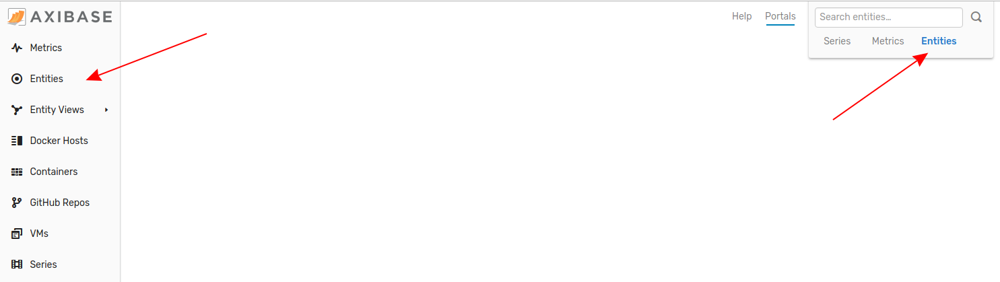
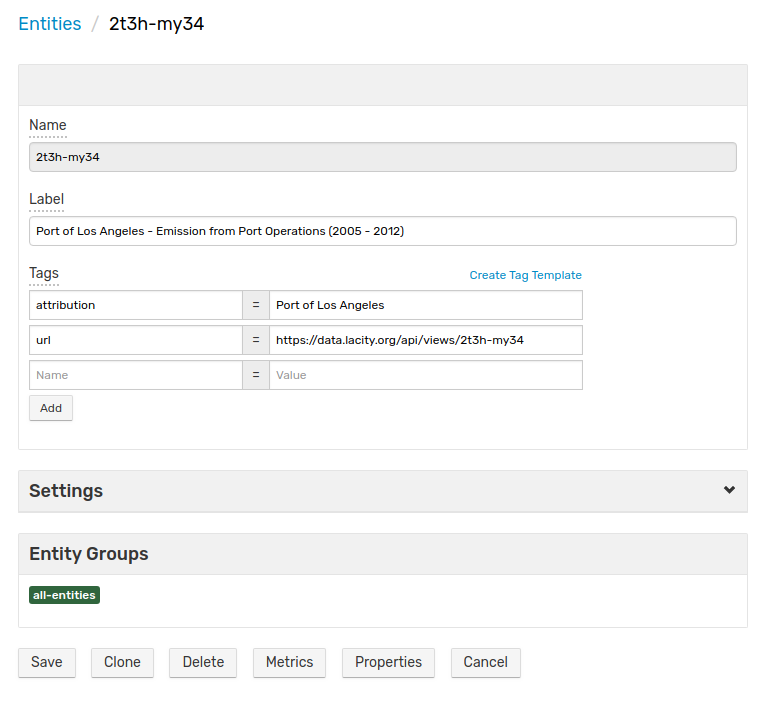
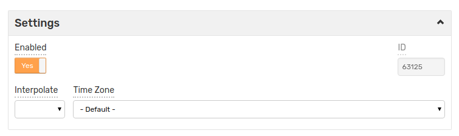
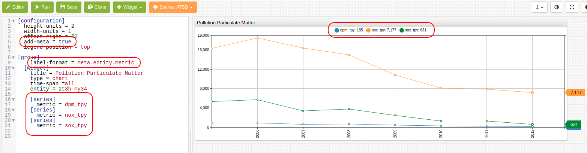
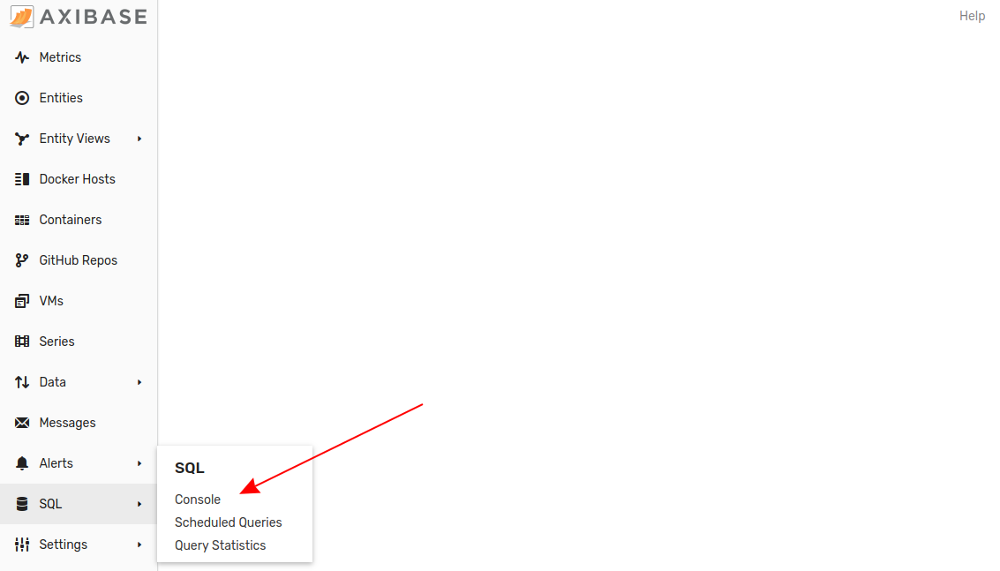
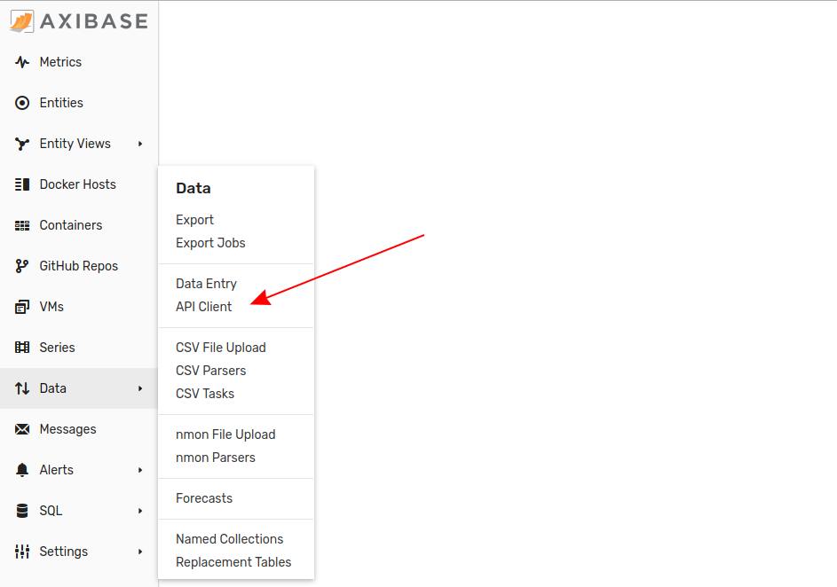
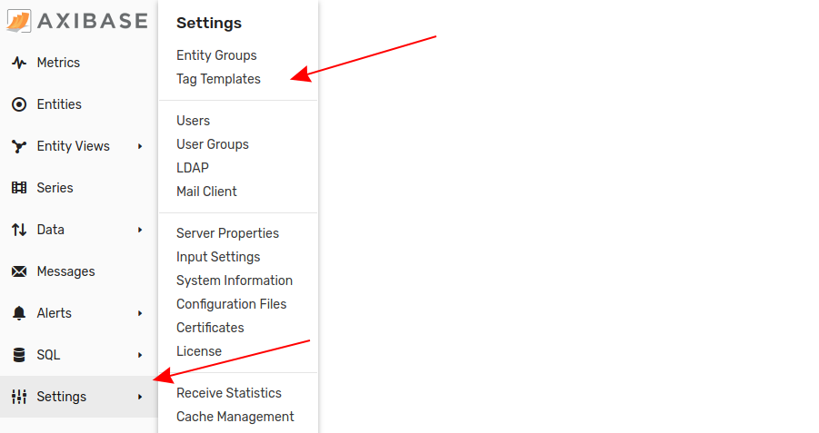

# Accessing Metadata in ATSD

Even medium-scale deployments of any time series database are likely to interact with hundreds of thousands, if not millions of series any given day; whether they are pruning old data or collecting and inserting new data, keeping track of the what is coming in and going out is important. Controlling and interpreting this massive two-way flow of information is most readily accomplished with metadata identifiers.

ATSD identifies metadata with three classifiers:

* [`entity` fields and tags](#entity-fields-and-tags);
* `metric` fields and tags;
* `series` tags.

The basic unit of metadata in ATSD is the `series` command. A simple, one-line syntax that quickly identifies a particular data point.

```css
series d:{iso-date} e:{entity} t:{tag-1}={val-1} m:{metric-1}={number}
```

The `series` command identifies all metadata quantifiers. See [`series` command](https://github.com/axibase/atsd/blob/master/api/network/series.md#series-command) documentation for complete information regarding how they may be used in ATSD.

Series metadata may be invoked several ways:

* Within the ATSD user interface;
* In [**Trends**](https://trends.axibase.com/053ff165) or [**ChartLab**](https://apps.axibase.com/chartlab/e926d483) via the [Charts API](https://axibase.com/products/axibase-time-series-database/visualization/);
* Via [SQL Console](https://github.com/axibase/atsd/tree/master/sql#overview);
* Through [Data API](https://github.com/axibase/atsd/tree/master/api/data#overview).

## `entity` Fields and Tags

### User Interface

Entity metadata is displayed on the **Entities** page, accessible from the **Entities** tab, or the **Search: Entities** bar upper window.



[`entity` fields](https://github.com/axibase/atsd/blob/master/api/meta/entity/list.md#fields) are available for all entities in ATSD and available at the top of any **Entities** page, and in the **Settings** section. Entities with default metadeta settings will automatically collapse the **Settings** menu.



Default metadata settings may be modified by opening the **Settings** menu.



Disabling an entity will discard incoming data and data-insertion commands will be written to `discarded_commands.log` file. Existing data will remain unaffected.

Entity tags may be used to describe custom attributes. Entity tags are stored as a modifiable table which may contain several subordinate tables with different tags. A pre-defined group of tags that is used for several entities is called a [Tag Template](#tag-templates).

### Charts API

To display `entity` fields in a **Charts** legend, add metadata import setting at the `[configuration]` level:

```javascript
add-meta=true
```

Metadata information may be used to label the appropriate data with simple syntax and without redundancy.



[](https://apps.axibase.com/chartlab/6aa6c515)

`label-format` setting may be included at any setting level and will apply label formatting based on [inheritance](https://axibase.com/products/axibase-time-series-database/visualization/widgets/inheritance/).

### SQL Console

**SQL Console** is an SQL-like syntax which may be used in the ATSD interface and query stored data. Open the **SQL** menu, and select **Console**.



Metadata may be accessed using dot notation:

```sql
entity.{field-name}
```

`entity` fields and tags may be queried using [defined syntax](https://github.com/axibase/atsd/tree/master/sql#entity-columns) in the [`SELECT`](https://github.com/axibase/atsd/tree/master/sql#select-expression), [`WHERE`](https://github.com/axibase/atsd/tree/master/sql#where-clause), and [`GROUP BY`](https://github.com/axibase/atsd/tree/master/sql#grouping) clauses.

The `boolean` field **Enabled** may be used to query only active data:

```sql
SELECT datetime, value
FROM dpm_tpy
WHERE entity = '2t3h-my34' AND entity.enabled = true
```

The result set is shown here:

| datetime            | value |
|---------------------|-------|
| 2005-01-01 00:00:00 | 891   |
| 2006-01-01 00:00:00 | 947   |
| 2007-01-01 00:00:00 | 627   |
| 2008-01-01 00:00:00 | 694   |
| 2009-01-01 00:00:00 | 448   |
| 2010-01-01 00:00:00 | 277   |
| 2011-01-01 00:00:00 | 259   |
| 2012-01-01 00:00:00 | 185   |

The same result set may be returned by querying entity tags instead of entity fields:

```sql
SELECT datetime, value
FROM dpm_tpy
WHERE entity = '2t3h-my34' AND entity.tags.attribution = 'Port of Los Angeles'
```

Likewise, entity tags may be used to group aggregated data:

```sql
SELECT AVG(value), MAX(value), MIN(value)
FROM dpm_tpy
WHERE entity = '2t3h-my34'
GROUP BY entity.tags.attribution = 'Port of Los Angeles'
```

The result set is shown here:

| avg(value) | max(value) | min(value) |
|------------|------------|------------|
| 541        | 947        | 185        |

### Data API

The [**Data API**](https://github.com/axibase/atsd/blob/master/api/data/README.md) is part of the ATSD User Interface and may be used to interact directly with the database; series may be inserted and retrieved from the same window. Open the **Data** menu and select **API Client**.



Entity fields and tags may be used to query data stored in ATSD via Data API using [`GET`](https://github.com/axibase/atsd/tree/master/api/meta/entity#meta-api-entities-methods) method. `GET` method is a single-line database search tool which queries all database entries and returns as many samples as instructed based on optional limit control field.

Consider the path:

```css
/api/v1/entities/2t3h-my34
```

The result set will contain all entity fields and tags:

```json
{
  "name": "2t3h-my34",
  "enabled": true,
  "lastInsertDate": "2012-01-01T00:00:00.000Z",
  "tags": {
    "attribution": "Port of Los Angeles",
    "url": "https://data.lacity.org/api/views/2t3h-my34"
  },
  "label": "Port of Los Angeles - Emission from Port Operations (2005 - 2012)"
}
```

More specific [`List`](https://github.com/axibase/atsd/blob/master/api/meta/entity/list.md) requests may be made using `GET` method. The `List` request searches the database for all entities which conform to user-specified paramaters based on request expression.

`List` requests extend the basic path:

```css
/api/v1/entities...
```

The complete expression may include several [parameters](https://github.com/axibase/atsd/blob/master/api/meta/entity/list.md#query-parameters).

Consider the request:

```java
name LIKE "2t3h-my34"
```

Search by `expression` parameter for the `name` of the desired entity:

```css
/api/v1/entities?expression=name%20like%20%272t3h-my34%27
```

Replace unsafe ASCII characters with HTML URL encoding symbols.

The result set will return all entities named `2t3h-my34` and assciated metadata in JSON format .

```json
[
  {
    "name": "2t3h-my34",
    "enabled": true,
    "lastInsertDate": "2012-01-01T00:00:00.000Z",
    "label": "Port of Los Angeles - Emission from Port Operations (2005 - 2012)"
  }
]
```

Entity tags must be included seperately in the request:

```java
name LIKE "2t3h-my34" & tags.*
```

Asterisk (*) is used as [wildcard](https://github.com/axibase/atsd/blob/master/api/data/series/examples/query-tags-wildcard.md).

The result set will be the same as above.

## Tag Templates

**Tag Templates** may be added manually in the ATSD interface or [uploaded](../../shared/import-tag-template.md) from a local drive.

