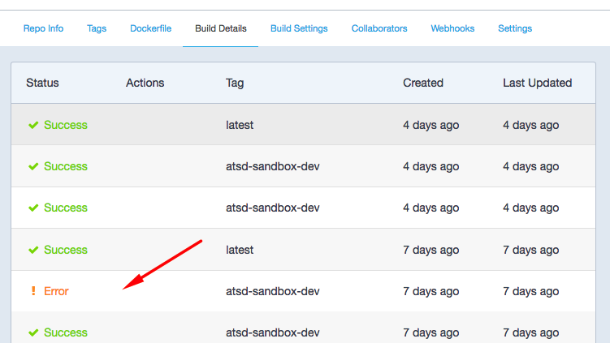
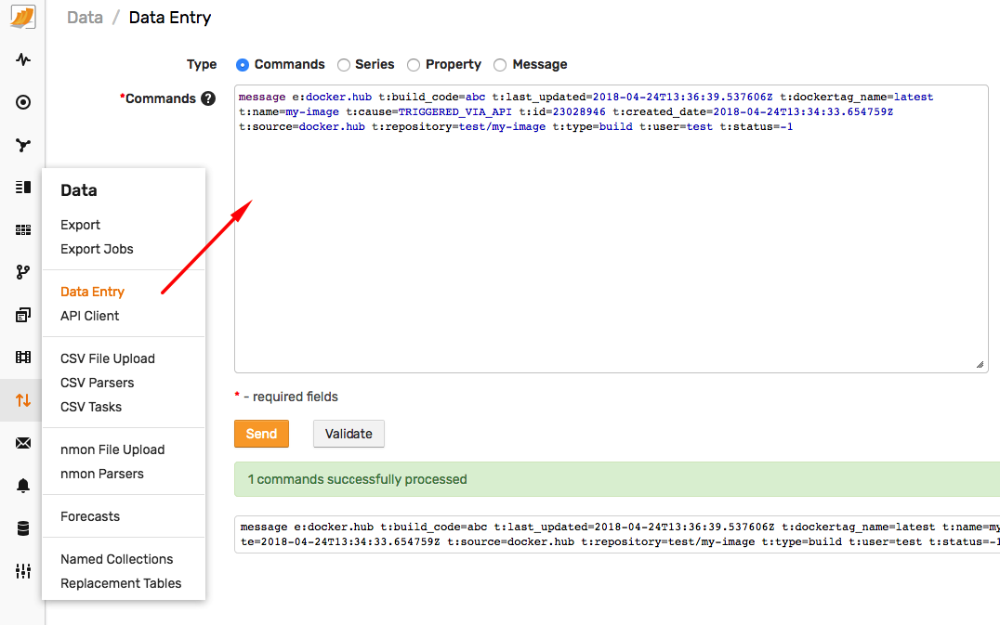

# Generate Webhook when Docker Hub Build Fails

## Overview

```
hello
```

If you have images hosted on the [Docker Hub](https://hub.docker.com)  registry, you need to monitor automated build jobs on Docker Hub to make sure that the images are successfully published and your CI pipeline remains healthy.

While the Docker Hub provides the capability to trigger [outgoing webhooks](https://docs.docker.com/docker-hub/webhooks/), they're only executed when the automated build completes **successfully**. If the job fails or if it is stuck in `Queued` status, webhooks are **not** fired and your team remains unaware of broken builds. This limitation is [known](https://forums.docker.com/t/docker-hub-webhook-on-build-failure/1166). The fix is currently not available.


While the email option can serve as a work-around for build failures, it's difficult to rely on it for programmable integration with alerting and CI systems. Also, an email alert is not dispatched when the build is queued for a long period of time.


This guide describes a solution, based on the rule engine implemented in [Axibase Time Series Database](https://github.com/axibase/atsd/tree/master/rule-engine#rule-engine), which polls the Docker Hub build history using the Docker Hub v2 API and generates missing webhooks in case of **build failures** or if the build is queued for more than 1 hour (this threshold is configurable).

## Build Failures

The build failures come in different flavors - some are caused by human error while others occur due to infrastructure changes outside of our control.

Human Error:


Errors with Dockerfile commands minified to reduce image layers require more effort to troubleshoot:


## Build History

The build history, containing success and failure statuses, is accessible under the **Build Details** tab in Docker Hub.



The history is also available via the **Docker Hub v2 API**.

https://hub.docker.com/v2/repositories/axibase/cadvisor/buildhistory/?page=1&page_size=5

The build has failed if its status is not 0 (`queued`), 3 (`pending`), or 10 (`completed`).

In the example below, the status is `-1` which is reported as `! Error` on Docker Hub.

```json
{
  "id": 23028946,
  "status": -1,
  "created_date": "2018-04-24T13:34:33.654759Z",
  "last_updated": "2018-04-24T13:36:39.537606Z",
  "build_code": "beedjaiuvjxk5m37uxjorja",
  "dockertag_name": "latest",
  "cause": "TRIGGERED_VIA_API"
}
```

## Webhook Solution

The proposed solution retrieves the most recent build record from the Docker Hub build history for all projects in the specified namespace and sends an HTTP notification to the consuming web service that you specify if the build status is not `3` or `10`, as well as when the status remains at `0` (Queued) for more than 1 hour.

### Webhook Payload `on-success`

Sample request payload generated by Docker Hub when the build succeeds.

```json
{
  "push_data": {
    "pushed_at": 1524572027,
    "images": [],
    "tag": "latest",
    "pusher": "axibase"
  },
  "callback_url": "https://registry.hub.docker.com/u/axibase/atsd/hook/123/",
  "repository": {
    "status": "Active",
    "description": "Axibase Time Series Database",
    "is_trusted": true,
    "full_description": "Axibase Time Series Database",
    "repo_url": "https://hub.docker.com/r/axibase/atsd",
    "owner": "axibase",
    "is_official": false,
    "is_private": false,
    "name": "atsd",
    "namespace": "axibase",
    "star_count": 5,
    "comment_count": 0,
    "date_created": 1433511877,
    "dockerfile": "REDACTED for brevity",
    "repo_name": "axibase/atsd"
  }
}
```

### Webhook Payload `on-error`

Request payload produced by ATSD.

The `on-error` payload is similar to the native `on-success` webhook above except the `repository.status` field is set to `Failed` (in case of build failure) or `Queued` (in case of hanging build) and an extra `build_history` object is present.

```json
{
  "build_history": {
    "id" : 23028946,
    "status" : -1,
    "created_date" : "2018-04-24T13:34:33.654759Z",
    "last_updated" : "2018-04-24T13:36:39.537606Z",
    "build_code" : "beedjaiuvjxk5m37uxjorja",
    "dockertag_name" : "latest",
    "cause" : "TRIGGERED_VIA_API"
  },
  "push_data": {
    "pushed_at": 1524632779,
    "images": [],
    "tag": "latest",
    "pusher": "axibase"
  },
  "repository": {
    "status": "Failed",
    "repo_url": "https://hub.docker.com/r/axibase/atsd",
    "owner": "axibase",
    "name": "atsd",
    "namespace": "axibase",
    "repo_name": "axibase/atsd"
  }
}
```

## Launch Instructions

Modify `NAMESPACE` variable in the command below to set it to your Docker Hub namespace, for example:

```sh
  --env NAMESPACE='google' \
```

Set `NOTIFY_URL` variable to a request URL where `on-error` webhook notifications will be sent, for example:

```sh
  --env NOTIFY_URL='https://host01:10443/jenkins/plugin?token=123' \
```

> By default, SSL certificate validation is disabled (configurable).

> The `NOTIFY_URL` may include user credentials for BASIC authorization.

Execute the command below to launch an [ATSD Sandbox](https://github.com/axibase/dockers/tree/atsd-sandbox) container.

```sh
docker run -d -p 8443:8443 -p 9443:9443 \
  --name=atsd-sandbox \
  --env NAMESPACE='my_hub_namespace' \
  --env NOTIFY_URL='https://my_host:10443/path?query=string' \
  --env ATSD_IMPORT_PATH='https://raw.githubusercontent.com/axibase/atsd-use-cases/master/how-to/docker/resources/rule.xml,https://raw.githubusercontent.com/axibase/atsd-use-cases/master/how-to/docker/resources/notify.xml' \
  --env COLLECTOR_IMPORT_PATH='https://raw.githubusercontent.com/axibase/atsd-use-cases/master/how-to/docker/resources/job.xml' \
  axibase/atsd-sandbox:latest
```

Watch the container start log for `All applications started` message.

```sh
docker logs -f atsd-sandbox
```

## Verification

Lets now verify that the webhook delivery is working as expected.

Go to Docker Hub and open Build Settings for one of the projects (images). Trigger a build for one of the branches known to fail.


The webhook should arrive less than 5 minutes which is the collector polling interval.

If you don't have a good failure candidate handy, send a test `message` command for `test/my-image` project as described below.

You can adjust the frequency in the collector UI at `https://docker_host:8443`. Open `dockerhub-poller` job and set Cron Expression to `0 * * * * ?` in order to run the data collection every minute.

## Troubleshooting

### Axibase Collector

Log in to Collector at `https://docker_host:9443` with [default](https://github.com/axibase/dockers/tree/atsd-sandbox#default-credentials) credentials.

Locate the `dockerhub-poller` job. Check that its status is 'Completed'.


### Axibase Time Series Database

Log in to ATSD at `https://docker_host:8443` with [default](https://github.com/axibase/dockers/tree/atsd-sandbox#default-credentials) credentials.

Open **Alerts > Web Notifications** page. Open `dockerhub-webhook-sender` notification. Click Test to verify connection.

Open **Data > Data Entry** page in the main menu. Submit the following command to emulate a build failure detected by Axibase Collector.

```ls
message e:docker.hub t:build_code=abc t:last_updated=2018-04-24T13:36:39.537606Z t:dockertag_name=latest t:name=my-image t:cause=TRIGGERED_VIA_API t:id=23028946 t:created_date=2018-04-24T13:34:33.654759Z t:source=docker.hub t:repository=test/my-image t:type=build t:user=test t:status=-1
```



Check that the `dockerhub-webhook-sender` status is `OK`.


The target service should receive the following JSON payload:

```json
{
  "build_history": {
    "id": 23028946,
    "status": -1,
    "created_date": "2018-04-24T13:34:33.654759Z",
    "last_updated": "2018-04-24T13:36:39.537606Z",
    "build_code": "abc",
    "dockertag_name": "latest",
    "cause": "TRIGGERED_VIA_API"
  },
  "push_data": {
    "pushed_at": 1524741369,
    "images": [],
    "tag": "latest",
    "pusher": "test"
  },
  "repository": {
    "status": "Failed",
    "repo_url": "https://hub.docker.com/r/test/my-image",
    "owner": "test",
    "name": "my-image",
    "namespace": "test",
    "repo_name": "test/my-image"
  }
}
```

## References

* Axibase Time Series Database [rule engine documentation](https://github.com/axibase/atsd/tree/master/rule-engine#rule-engine).
* Axibase Collector [JSON job documentation](https://github.com/axibase/axibase-collector/blob/master/jobs/json.md).
* Raise an [issue](https://github.com/axibase/atsd-use-cases/issues/new) in case you need support. 
